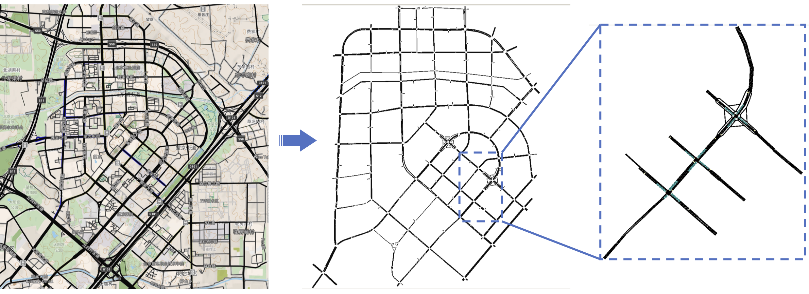

SUMO Beijing Wangjing 3 Crossings Env
######################################

This is a simple 3 crossings real roadmap extracted from Wangjing area of Beijing in SUMO.
There are 3 crossing signals arranged in a row. Each crossing has 4 directions and 3-5
lanes at each diraction, and the lane is flared (widen near crossing) to enable greater
traffic flow. This is a tiny environment to investigate RL policy performance under real
roadmap. The shape of the road network is as follows.

Configuration
================

The roadmap files and SUMO configs are stored in ``smartcross/envs/sumo_wj3``. We provide
a standard RL env config in ``smartcross/envs/sumo_wj3_default_config.yaml``. Users can
modify RL env according to the instructions of SUMO env configs.
